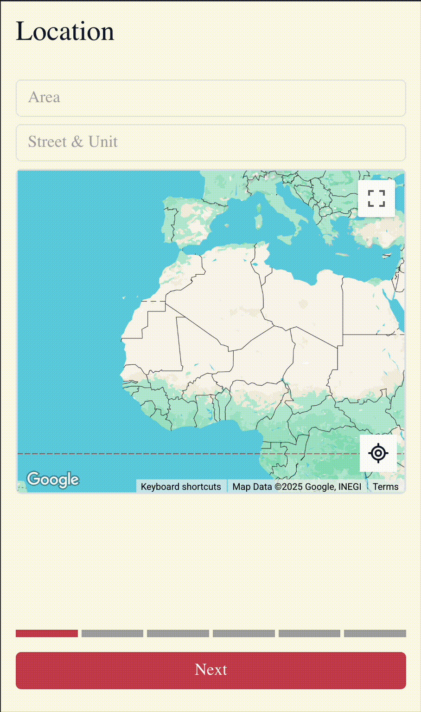
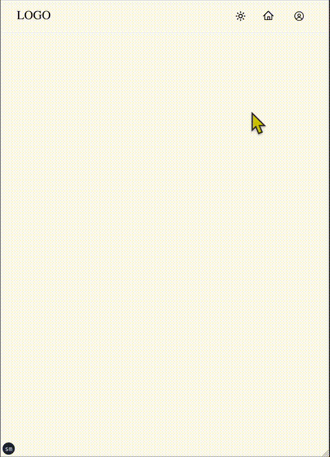

<!-- Banner Image (Optional) -->
<!--  -->

   
   
   
   
   
  
  
  
   
   
   
  
  Hi, I'm Imad - Fullstack Engineer and Nature lover
  

    <a href="mailto:imadrajwani@gmail.com">E-Mail</a> • 
    <a href="https://jaywcjlove.github.io/#/sponsor">Sponsor</a> • 
  

   
  
  

    🧑‍🍳 Founder - <a href="https://nutrimap.netlify.app">NutriMap</a> & 🌡️ Platform Engineer at <a href="https://www.checkit.net/">Checkit Plc</a>.
  

   
  
✦ 📱 Apps ✦

   
    <table style="border-collapse: collapse; border: none; width: 100%;">
      <tr>
        <td style="padding:8px; vertical-align: top;"></td>
        <td style="padding:8px; vertical-align: top;"></td>
      </tr>
      <tr>
        <td style="padding:8px; vertical-align: top;"></td>
        <td style="padding:8px; vertical-align: top;"></td>
      </tr>
    </table>
   

  
Specialities

  - Sleek Product Design
  - Enterprise Cloud Native Systems

  
Interests

  - IoT & Work Management
  - Real Estate
  - Food
  - Grocery Delivery

