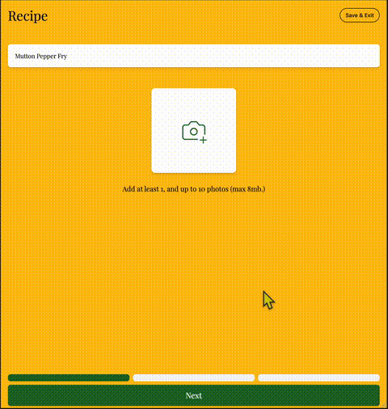

<!-- Banner Image (Optional) -->
<!--  -->

   
   
   
   
   
  
  
  
   
   
   
  
  Hi, I'm Imad - Fullstack Engineer and Nature lover
  

    <a href="mailto:imadrajwani@gmail.com">E-Mail</a> • 
    <a href="https://jaywcjlove.github.io/#/sponsor">Sponsor</a> • 
  

   
   
  
  ✦ My macOS/iOS application ✦

   
    <table>
    <tr>
      <td style="padding:8px;"></td>
      <td style="padding:8px;"></td>
    </tr>
    <tr>
      <td style="padding:8px;"></td>
      <td style="padding:8px;"></td>
    </tr>
    </table>
   

)

<h3> Welcome 👋, I specialize in Product Design & Fullstack Engineering</h3>

<h4>Founder - [NutriMap](https://nutrimap.netlify.app/)</h2>

💼 I ship enterprise cloud-native systems and platform features at Checkit Plc

<h4>Product development history</h4>
